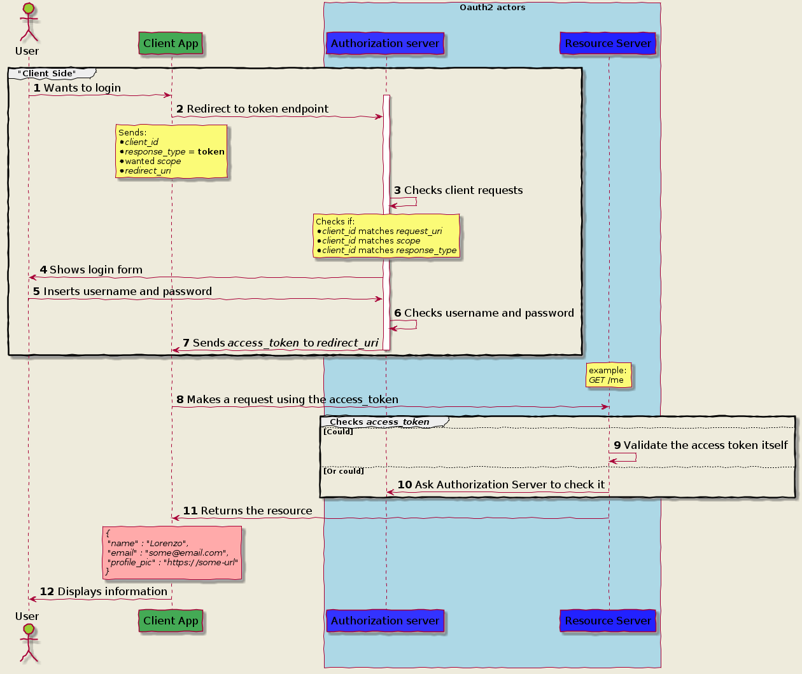

---
title: OAuth2.0 的4种授权流程
date: 2018-12-12
category:
  - 编程技术
tag:
  - OAuth2.0
  - REVIEW
--- 

> [How OAuth 2.0 works and how to choose the right flow](https://itnext.io/an-oauth-2-0-introduction-for-beginners-6e386b19f7a9)
> 作者：[Lorenzo Spyna](https://itnext.io/@spyna?source=post_header_lockup)

学习了一下OAuth 2.0 的认证流程，这篇文章很不错，流程图很清晰，OAuth 2.0的4种认证流程做了清晰说明和区别，并给了要使用OAuth 2.0 的技术选型参考。

## OAuth2.0 Cheet Sheet

## OAuth2.0 的4种授权流程

### Authorization Code - 授权码模式

   

### Implicit - 隐式授权模式

### Client Credential - 客户端模式

### Password -密码授权模式

## 到底该选择哪一种授权模式呢？

