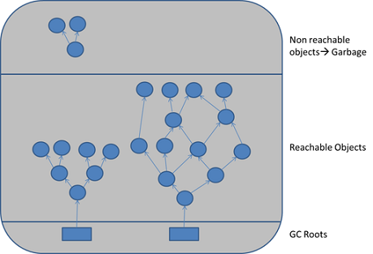
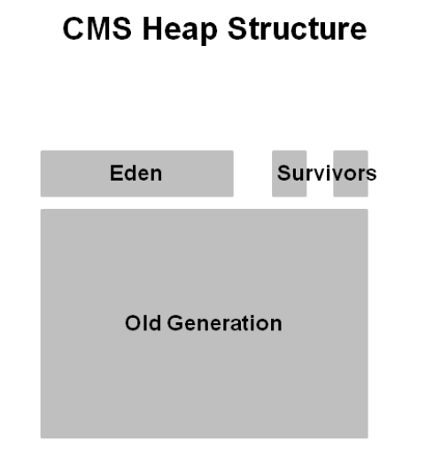
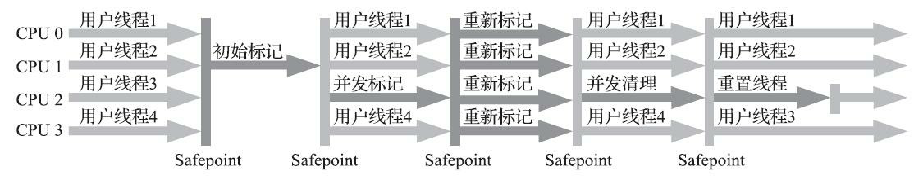
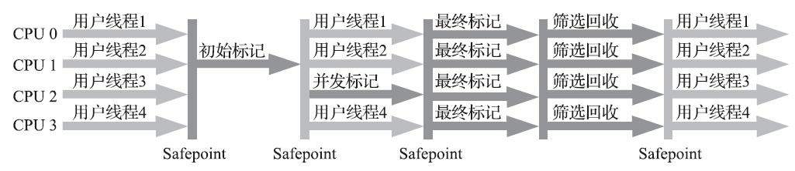

>本篇是学习 JVM 的一些知识点总结，翻阅了大量参考资料，不求多深入到细节，只求把一些重点的内容整理出来，所有参考资料均在文章末尾列出，这些参考资料才是最大的宝藏，文章所引用图片均来自于互联网。

一般来讲，JVM 的架构分为3个部分：类加载子系统、运行时数据区域、执行引擎。如下图。

类加载子系统将二进制的字节码读入和转换成虚拟机能够处理的数据结构，Java 虚拟机在执行Java程序的过程中将它所管理的内存区域划分为若干不同的数据区域，这些区域有不同作用，统称为运行时数据区域。执行引擎是虚拟机的执行字节码的概念模型，在虚拟机的实现中有解释执行（通过解释器执行）和编译执行（通过即时编译器生成本地代码执行）2种类型。


## 1 类加载机制

类加载机制通过类加载器（Class Loader）来将二进制的字节码加载到虚拟机内存中来，类加载的过程包括了加载、连接、初始化三个阶段。其中连接阶段又包括了验证、准备、解析三个步骤。类加载的各阶段会按照严格顺序开始启动，但并不是一定要等一个阶段执行完了才会开始下一个，可能会同步进行。


#### 1. 1 类加载过程

1. **加载(Loading)** 通过类的全限定名获取该类的二进制流，将二进制的静态结构转化成方法区的运行时数据结构，在内存中生成一个Class 对象作为该方法区数据结构的入口。数组类不通过类的加载器创建，而是由虚拟机直接创建，但数组类的元素类型（Element Type）需要类加载器创建。
2. **连接(Linking)**

   - 验证(Verification)：验证 Class 文件的字节流中包含的信息符合当前虚拟机的要求

   - 准备(Preparation)：为类变量（静态变量）和常量分配内存和零值(reference=null)

   - 解析(Resolution)：将常量池里面的符号引用解析成直接引用（非必须）
3. **初始化(Initialization)** 执行类构造器 `<clinit>` 方法，类构造器是编译器自动收集的类变量赋值语句和由 static 块语句合并产生的，虚拟机保证父类中的`<clinit>`先执行，并确保只执行一次。

>注意: 类构造器`<clinit>` 与实例的构造器`<init>`(即构造函数)的区别，类构造器是一些静态变量和 static 语句组成，由编译器生成，在初始化的时候被调用。

#### 1.2 类加载时机

类加载的第一个阶段（加载）虚拟机规范没有明确规定，但是类的初始化阶段有明确的规范，JVM 规范枚举了下述多种触发初始化的情况：

1. 当虚拟机启动时，初始化用户指定的主类；
2. 当遇到用以新建目标类实例的 new 指令时，初始化 new 指令的目标类；
3. 当遇到调用静态方法的指令时，初始化该静态方法所在的类；
4. 当遇到访问静态字段的指令时，初始化该静态字段所在的类；
5. 子类的初始化会触发父类的初始化；
6. 如果一个接口定义了 default 方法，那么直接实现或者间接实现该接口的类的初始化，会触发该接口的初始化；
7. 使用反射 API 对某个类进行反射调用时，初始化这个类；
8. 当初次调用 MethodHandle 实例时，初始化该 MethodHandle 指向的方法所在的类

#### 1.3 类加载器 - Class Loader

类加载器的作用是，通过一个类的全限定名来获取描述此类的二进制字节流。有3种类型的 Class Loader:

- Bootstrap Class Loader: JDK core libraries, rt.jar
- Extension(Platform) Class Loader: load JDK extensions, $JAVA_HOME/lib/ext
- Application Class Loader: load the classes in the classpath

其中 Bootstrap Class Loader 是顶级类加载器（根加载器），Extension 加载器是扩展加载器，其父类是Bootstrap 加载器，Application 类加载器是应用加载器，也就是Java程序一般用到的类加载器，其父类是 Extension 加载器。

**双亲委派机制**: 加载一个类时，先查询是否已经加载过该类，若没被加载过，则委托给父类加载器去加载（也会先查是否加载过），若父加载器无法加载，则子类加载器自己尝试加载该类。（确保一个类只被加载一次）

加载类的可见性：子加载器可以看到被父类加载器已经加载过的类，但是反过来不行。

**Context Class Loader** : 解决类似于 JNDI 这种由 Bootstrap Class Loader 加载，但是实现类为各厂商提供在用户 classpath 下无法被Bootstrap Class Loader 加载的问题，可以通过 Thread 的 setContextClassLoader 设置，默认为 Application Class Loader.

> 提问：Class.forName 和 ClassLoader.loadClass 都能加载类，这两者在加载类时有何区别？

## 2 JVM 运行时内存区域

### 2.1 运行时数据区

- 方法区(Method Area)

  线程共享，存储类信息，运行时常量池，静态变量，即时编译后的代码等。需要注意的是，方法区是一个逻辑概念，其实现取决于具体的虚拟机。

- 堆（Heap）

  线程共享，对象存储主要区域

- 虚拟机栈 (Java VM Stack)

  线程私有，Java 方法执行区域，方法的执行对应着栈帧的入栈与出栈；栈帧存放局部变量表，操作数栈，动态链接，方法出口等信息

- 本地方法栈（Native Method Stack）

  线程私有，与 Java方法栈类似，用于本地方法的调用

- 程序计数器（PC Register）

  线程私有，当前线程所执行的字节码的行号指示器

### 2.2 JVM 内对象的创建

#### Java 对象的创建过程

1. 首先会判断对象对应的类是否加载过，如果未加载，则进行类加载
2. 类加载完毕后会进行内存的分配，内存的分配方式取决于采用的垃圾收集器，考虑线程安全会用到 CAS加失败重试来分配或者使用 Thread Local Allocation Buffer 来给每个线程预先分配一块内存用于对象分配
3. 虚拟机将分配到的内存初始化为零值，使对象不用赋值就能使用，
4. 设置对象元信息等（类信息，GC标志等）
5. 最后按照程序的要求执行对象的 `<init>` 方法（即构造函数）

#### 对象的内存布局


- 对象头 Header
  - Mark Word：对象自身运行时数据，如哈希码，GC分代，锁状态等
  - 类型指针
  - 如果是数组，还有记录数组大小的数据
- 实例数据 Instance Data
- 对齐填充 Padding：当对象实例数据没有对齐时会有

#### 对象的访问方式

Java程序会通过栈上的 reference 来操作堆上的具体对象。具体的对象访问方式由虚拟机决定，主要有两种方式：

- 句柄访问：Java堆中将可能会划分出一块内存来作为句柄池，reference 中存储的就是对象的句柄地址，而句柄中包含了对象实例指针与类型数据指针(方法区)，好处是垃圾收集移动对象的时候只需改变句柄中对象实例指针，reference 本身不用修改


- 直接指针访问：reference  直接指向堆中的对象实例，而对象实例中包含数据和指向类型数据的指针(指向方法区)，好处就是访问对象速度更快，它节省了一次指针定位的时间开销( HotSpot 使用这种方式)


## 3 内存回收

### 3.1 存活对象的判断

- 引用计数法

  每当对象被引用时，其引用计数器加1，为0时代表无引用；无法解决循环引用问题

- 可达性分析算法

  从 GC Root 开始遍历引用，能够到达的对象为存活对象，无法达到的对象未不可达对象，即垃圾收集的目标对象

  

##### GC Roots

- Java 方法栈帧中引用的对象，如各线程中被调用方法堆栈中使用的参数，局部变量，临时变量等。
- 方法区中类静态变量引用的对象，即 Java 类引用的静态变量
- 方法区中常量引用的对象，如字符串常量池里的引用
- 本地方法栈中 JNI（Native 方法）引用的对象
- Java 虚拟机内部的引用，如基本数据类型对应的 Class 对象，一些常驻的异常对象等，系统类加载器
- 所有被同步锁（synchronized关键字）持有的对象
- 反映Java 虚拟机内部情况的 JMXBean、JVMTI 中注册的回调、本地代码缓存等。

除了以上固定的 GC Roots 集合外，根据所选垃圾收集器及当前回收内存区域的不同，还有其他对象加入 GC Roots集合。

##### Java 引用类型

(强弱顺序由上到下)

- 强引用 Strong Reference

  默认的引用类型，只要强引用存在，GC不会回收该强引用。

- 软引用 SoftReference

  对于软引用关联的对象，在要发生内存溢出之前，才会把这些对象放入GC的回收范围，如果此时 GC回收还是没有足够的内存，才会抛出内存溢出异常。

- 弱引用 WeakReference

  被弱引用关联的对象只能生存到下一次 GC 发生之前，GC时无论内存是否够都会回收。

- 虚引用 PhantomReference

  无法通过虚引用来得到一个对象实例，关联虚引用的唯一目的是在GC时收到一个系统通知

##### 方法区的回收

方法区主要回收两部分内容：废弃的常量和不再使用的类型

- 废弃的常量：举个常量池中字面量回收的例子，假如一个字符串“java”曾经进入常量池中，当前系统已经没有任何字符串对象引用常量池中的“java”常量，且虚拟机中也没有其他地方引用这个字面量。如果在这时发生内存回收，而且垃圾收集器判断确有必要的话，这个“java”常量就将会被清理出常量池。常量池中其他类（接口）、方法、字段的符号引用也与此类似
- 不再使用的类型需要做类卸载，需要满足以下三个条件才会回收：
  - 该类所有的实例都已经被回收，也就是Java堆中不存在该类及其任何派生子类的实例
  - 加载该类的类加载器已经被回收，该条件很难达到，除非经过设计如 OSGi、JSP的重加载
  - 对应的java.lang.Class对象没有在任何地方被引用，无法在任何地方通过反射访问该类的方法

### 3.2 垃圾收集

#### 1 分代收集理论

1. 弱分代假说：绝大多数对象都是朝生夕灭的

2. 强分代假说：熬过越多次垃圾收集过程的对象就越难以消亡
3. 跨引用假说：跨代引用相对于同代引用来说仅占极少数

#### 2 垃圾收集算法

*(注：下面提到的收集器均是 HotSpot 虚拟机里面的收集器 )*

- **标记-清除算法 Mark-Sweep**

  描述：首先标记出所有需要回收的对象，在标记完成后，统一回收掉所有被标记的对象，也可以反过来，标记存活的对象，统一回收所有未被标记的对象

  特点：1.执行效率不稳定；2.回收后的空间不连续，容易产生内存碎片

  应用：CMS 收集器关注延迟，因为不移动对象

- **标记-复制算法 Mark-Copy**

  描述：将内存区域一分为2，对象分配时只使用其中一块区域，回收时先标记出所有需要回收的对象，标记完成后，复制所有存活对象的对象到另外一块未使用的区域，然后清除已使用的那块内存

  特点：只能使用一半的内存，但是能保证空间的连续性。存活对象少时适用

  应用：HotSpot JVM 新生代内存的内存回收(Eden + 2个Survivor, 见下面的图)

- **标记-整理算法 Mark-Compact**

  描述：先标记存活的对象，然后将存活对象压缩到内存的一端，最后清理边界外的空间。

  特点：需要移动存活的对象(对比标记清除算法)，暂停用户线程(STW)

  应用：Parallel Scavenge 收集器，关注吞吐量，因为整理碎片

  **对比总结如下：**

  | 比较维度 | Mark-Sweep | Mark-Compact | Mark-Copy               |
  | :------- | :--------- | :----------- | ----------------------- |
  | 速度     | 中等       | 最慢         | 最快                    |
  | 空间开销 | 少         | 少           | 一般需要活动对象的 2 倍 |
  | 移动对象 | 否         | 是           | 是                      |
  | 内存碎片 | 有         | 无           | 无                      |

#### 3 内存分配策略

(*基于分代收集理论的垃圾收集器*)


*(参考：[Java Garbage Collection Logs & How to Analyze Them - Sematext]([Java Garbage Collection Logs & How to Analyze Them - Sematext](https://sematext.com/blog/java-garbage-collection-logs/)))*

对象分配的规则并不是固定的， 《Java虚拟机规范》并未规定新对象的创建和存储细节，这取决于虚拟机当前使用的是哪一种垃圾收集器，以及虚拟机中与内存相关的参数的设定。

有一些基本的内存分配原则：

- 对象优先分配在 Eden 区，当 Eden 区没有足够空间分配时，将发生 Minor GC
- 大对象直接进入老年代（需要大量连续内存空间的对象，如长字符串，大数组）
- 长期存活的对象进入老年代 （-XX:MaxTenuringThreshold）
- 空间分配担保

> GC 名词解释
>
> Partial GC: 指目标不是完整收集整个Java堆的垃圾收集，包括：
>
> - Minor GC/Young GC: 发生在新生代的垃圾收集动作
>
> - Major GC/Old GC: 发生老年代的垃圾收集
> - Mixed GC: 指目标是收集整个新生代以及部分老年代的垃圾收集。目前只有G1收集器会有这种行为。
>
> Full GC： 收集整个 Java 堆和方法区的垃圾收集

### 4 常见的 HotSpot 垃圾收集器


HotSpot 的垃圾收集器：

- 新生代收集器：Serial、ParNew、Parallel Scavenge
- 老年代收集器：CMS、Serial Old、Parallel Old
- 全局收集器：G1

##### 1 Serial、Serial Old 收集器

Serial 收集器使用一个单线程来做垃圾搜集的任务，在垃圾收集时，必须暂停其他所有工作线程直到它收集结束（STW: Stop-The-World）。

Serial Old 收集器使用标记-整理算法来收集老年代。

特点：1.单线程；2.内存消耗小，适应于运行在客户端模式的虚拟机


*（Serial + Serial Old 收集器运行示意图，Serial Old 是 Serial 收集器的老年代版本）*

##### 2 ParNew 收集器

ParNew 收集器（新生代）是 Serial 收集器的多线程并行版本，JDK9之后，唯一能与 CMS 收集器（老年代）配合工作的收集器。


*（ParNew + Serial Old 收集器运行示意图，Serial Old 是 Serial 收集器的老年代版本）*

> 垃圾收集器语境下的并行与并发：
>
> - 并行(Parallel): 指多条 GC 线程之间的关系，同一时间有多条垃圾收集线程在协同工作，用户线程处于等待状态。
> - 并发(Concurrent)：GC 线程与用户线程之间的关系，同一时间垃圾收集线程与用户线程都在运行。

##### 3 Parallel Scavenge ，Parallel Old 收集器

Parallel Scavenge 与 ParNew 比较类似，新生代收集器，基于标记-复制算法实现，专注于吞吐量（Throughput）的收集器，别名"吞吐量优先收集器"。能够通过参数来设置更关注最大停顿时间(-XX:MaxGCPauseMillis)，或更关注吞吐量(-XX:GCTimeRatio)，还能使用自适应的调节策略(GC Ergonomics) 来让虚拟机自己来做内存的调优任务。

Parallel Old 是 Parallel Scavenge 的来年代版本，支持多线程并行收集，基于标记-整理算法实现。

> 吞吐量： 运行用户代码的时间/ (运行用户代码的时间+运行垃圾收集时间)。假设用户代码运行时间加上垃圾收集时间为100分钟，垃圾收集时间为1分钟，则吞吐量为99%，高的吞吐量能够高效地利用处理器的资源。


*（Parallel Scavenge/Parallel Old收集器运行示意图）*

##### 4 CMS 收集器 



CMS (Concurrent Mark Sweep) 收集器（JDK9 标记为Deprecated），以获取最短回收停顿时间为目标的收集器，基于标记-清除算法，整个过程分为4个步骤：

1. 初始标记（initial mark）：仅仅标记一下 GC Roots能直接关联的对象，速度快，`需要 STW`
2. 并发标记（concurrent mark）：从GC Roots直接关联对象开始遍历对象图的过程，并发执行
3. 重新标记（remark）：修正并发标记阶段改变的对象标记，多线程执行，时间相对也短，`需要 STW`
4. 并发清除（concurrent sweep）：并发清除需要收集的对象，与用户线程同时执行



*（CMS 收集器运行示意图）*

特点：并发收集，低停顿

缺点:

1. CMS收集器对处理器资源非常敏感，会因为占用了一部分线程（或者说处理器的计算能力）而导致应用程序变慢，降低总吞吐量。
2. CMS 收集器无法处理浮动垃圾(Floating Garbage)，有可能出现并发失败（Concurrent Mode Failure）进而导致另一次完全“Stop The World”的Full GC的产生，老年代的内存使用率达到一定值时（-XX:CMSInitiatingOccupancyFraction）会激活 CMS 收集器，若该值设置过高可能会导致 CMS 运行期间内存不够分配新对象（内存回收赶不上内存分配），导致并发失败，最后临时启用后备预案的 Serial Old 收集老年代。
3. 因为 CMS 采用的是标记-清除算法，所以会有内存碎片的问题，遇到大对象无法分配时不得不提前出发 Full GC，通过参数可以设置在进行 Full GC 时开启内存碎片整理过程，整理过程要移动对象，停顿时间也会变长

> 浮动垃圾(Floating Garbage)：在CMS的并发标记和并发清理阶段，用户线程是还在继续运行的，程序在运行自然就还会伴随有新的垃圾对象不断产生，但这一部分垃圾对象是出现在标记过程结束以后，CMS无法在当次收集中处理掉它们，只好留待下一次垃圾收集时再清理掉。这一部分垃圾就称为“浮动垃圾”。

##### 5 Garbage First (G1) 收集器

G1 收集器的目的是提供一个在延迟和吞吐量之间达到最佳平衡。

G1 收集器把连续的 Java 堆划分为多个大小相等的独立区域（Region），每一个 Region 都可以（在逻辑上）根据需要作为新生代的 Eden、Survivor空间，或老年代空间，收集器根据不同 Region 扮演的角色采用不同的策略去处理。


*（G1 收集器将内存划分为多个 Region）*

G1 收集器的运作过程大体划分为4个步骤：

根据《深入理解Java虚拟机(第3版)》分为4个步骤，官方文档上面分的更细，请参考[Getting Started with the G1 Garbage Collector (oracle.com)](https://www.oracle.com/technetwork/tutorials/tutorials-1876574.html#:~:text=G1 is planned as the long term replacement,lists for allocation%2C and instead relies on regions.)

1. 初始标记(Initial Marking)：仅仅标记一下 GC Roots能直接关联的对象，并修改 `TAMS` 指针的值方便下阶段并发运行时能分配新对象，这个阶段耗时短，需要停顿线程，在 Minor GC 时同步完成。
2. 并发标记(Concurrent Marking)：从GC Roots直接关联对象开始遍历对象图的过程，并发执行
3. 最终标记(Final Marking)：对用户线程做另一个短暂的暂停，用于处理并发阶段结束后仍遗留下来的最后那少量的 `SATB` 记录。
4. 筛选回收(Live Data Counting and Evacuation)：更新 Region的统计数据，对各Region 的回收价值和成本进行排序，根据用户期望指定回收计划，将决定回收的那一部分 Region的存活多谢复制到空的 Region中，再清理掉整个旧的 Region。需要移动存活对象，需要 STW，由多条线程并行完成。



*(G1 收集器运行示意图)*

> **Humongous Region** : 除了 Eden，Survivor，Old Region外，还有一类 Humongous Region 专门用来存储大对象，G1 对大小超过一个 Region容量一半的对象判定为大对象，Region的大小通过 -XX:G1HeapRegionSize 设置，取值为1MB~32MB，且应为2的N次幂。对于超大的对象，超过了一个Region容量的，会被放在多个连续的Humongous Region 中，G1 在多数情况下将 H 区域当作老年代看待。
>
> **TAMS**：在垃圾收集的同时，用户线程也在分配新的对象，G1 收集器为每一个 Region 设计了2个 TAMS(Top at Mark Start) 指针，把 Region 中的一部分空间划出来给并发收集过程中新对象的分配，G1 默认在这 2个地址上的对象是被标记为存活的，不纳入回收范围。如果发生内存回收的速度赶不上内存分配的速度，G1 也要冻结用户线程，导致 Full GC 而产生长时间的 Stop The World 停顿。
>
> **SATB**: 原始快照算法。见并发的可达性分析算法细节。

G1 的适应场景([Garbage-First Garbage Collector Tuning (oracle.com)](https://docs.oracle.com/javase/8/docs/technotes/guides/vm/gctuning/g1_gc_tuning.html))：

- 堆空间存活对象超过50%

- 对象分配和晋升十分频繁
- 避免长时间的 GC 停顿（长于0.5~1秒）

###### G1 和 CMS 的区别

- 使用范围不一样：CMS 是老年代收集器，G1 收集整个堆空间
- STW 停顿时间：CMS 以最小的停顿时间为目标，G1 可预测GC的停顿时间
- CMS 基于标记-清除算法，容易产生内存碎片，G1 的Mixed Collections(整体上看使用标记-整理算法,局部上使用复制算法)，不会产生内存碎片
- 记忆集，G1的实现更加复杂，每个 Region都有卡表记录跨代引用，CMS只有一个卡表

##### 6 GC 性能的衡量指标

一个垃圾收集器的性能好坏可以借助一些指标来衡量。

- 吞吐量：运行用户代码的时间/ (运行用户代码的时间+运行垃圾收集时间)
- 停顿时间：指垃圾收集器运行时，用户线程的暂停时间
- 垃圾回收频率：多久发生一次垃圾回收？通常垃圾回收的频率越低越好

### 5 HotSpot 虚拟机的一些垃圾收集算法实现

#### 1 根节点枚举

Java虚拟机 HotSpot 的实现中，使用一组称为OopMap的数据结构来存放对象引用，从而可以快速且准确的完成GC Root扫描。但程序执行的过程中，引用关系随时都可能发生变化，而HotSpot虚拟机只会在特殊的指令位置才会生成 OopMap来记录引用关系，这些位置便被称为Safepoint。换句话说，就是在Safepoint这个点上，虚拟机对于调用栈、寄存器等一些重要的数据区域里什么地方包含了什么引用是十分清楚的，这个时候是可以很快完成GC Roots的扫描和可达性分析的。HotSpot会在所有方法的临返回之前，以及所有Uncounted loop的循环回跳之前放置 Safepoint。当需要GC时候，虚拟机会首先设置一个标志，然后等待所有线程进入Safepoint，但是不同线程进入Safepoint 的时间点不一样，先进入Safepoint 的线程需要等待其他线程全部进入Safepoint，所以Safepoint是会导致STW的。

#### 2 安全点 Safe Point 与安全区 Safe Region

[JVM相关 - SafePoint 与 Stop The World 全解 - 知乎 (zhihu.com)](https://zhuanlan.zhihu.com/p/161710652)

[现代JVM中的Safe Region和Safe Point到底是如何定义和划分的? - 知乎 (zhihu.com)](https://www.zhihu.com/question/29268019)

安全点可以理解成是在代码执行过程中的一些特殊位置，当线程执行到这些位置的时候，线程可以暂停。

安全区域是指能够确保在某一段代码片段之中，引用关系不会发生变化，因此，在这个区域中任意地方开始垃圾收集都是安全的。我们也可以把安全区域看作被扩展拉伸了的安全点。

**Counted loop**: JVM认为比较短的循环，所以不会放置Safepoint，比如用int作为index的循环。与其对应的是Uncounted loop。

**Uncounted loop**:JVM会在每次循环回跳之前放置Safepoint，比如用long作为index的循环。所以一个常见的问题是当某个线程跑进了Counted loop时，JVM启动了GC，然后需要等待这个线程把循环跑完才能进入Safepoint，如果这个循环是个大循环，且循环内执行的比较慢，而且不存在其他函数调用产生其他Safepoint，这时就需要等待该线程跑完循环才能从其他位置进入Safepoint，这就导致了其他线程可能会长时间的STW。

> 可以参考小米云分享的由于 Safepoint 导致长时间停顿的案例：[HBase实战：记一次Safepoint导致长时间STW的踩坑之旅 - 掘金 (juejin.cn)](https://juejin.cn/post/6844903878765314061)

#### 3 记忆集(Remembered Set) 与卡表 (Card Table)

为解决对象跨代引用所带来的问题，垃圾收集器在新生代中建立了名为记忆集（Remembered Set）的数据结构，用以避免把整个老年代加进GC Roots扫描范围。记忆集是一种用于记录从非收集区域指向收集区域的指针集合的抽象数据结构。

卡表（Card Table）是记忆集的一种实现方式，字节数组CARD_TABLE的每一个元素都对应着其标识的内存区域中一块特定大小的内存块，这个内存块被称作“卡页”（Card Page）,一个卡页的内存中通常包含不止一个对象，只要卡页内有一个（或更多）对象的字段存在着跨代指针，那就将对应卡表的数组元素的值标识为1，称为这个元素变脏（Dirty），没有则标识为0。在垃圾收集发生时，只要筛选出卡表中变脏的元素，就能轻易得出哪些卡页内存块中包含跨代指针，把它们加入GC Roots中一并扫描。

> [Psychosomatic, Lobotomy, Saw: The JVM Write Barrier - Card Marking (psy-lob-saw.blogspot.com)](http://psy-lob-saw.blogspot.com/2014/10/the-jvm-write-barrier-card-marking.html)

#### 4 写屏障 Write Barrier

解决卡表元素如何维护的问题，例如它们何时变脏、谁来把它们变脏等。

写屏障可以看作在虚拟机层面对“引用类型字段赋值”这个动作的AOP切面，在引用对象赋值时会产生一个环形（Around）通知，HotSpot 使用写后屏障来更新卡表，一旦引用对象更新则更新卡表。

但是卡表还有另外一个问题，就是“伪共享”（false sharing），因为缓存行的原因，导致性能下降，解决方案是在更新之前先判断是否已经更新过。开启判断会增加一次额外判断的开销，但能够避免伪共享问题，两者各有性能损耗，是否打开要根据应用实际运行情况来进行测试权衡。

#### 5 并发的可达性分析算法

“标记”阶段是所有追踪式垃圾收集算法的共同特征，朴素的“标记-清除”算法有一个缺点，在对象的标记过程中，对象的关系图是不能修改的，这个时候需要暂停用户线程来保证对象关系在一个一致的状态里，这种情况是一些实时应用和对响应比较敏感的应用是无法接受的。这个时候就需要能够支持并发的标记算法。


*（朴素的 mark-sweep 过程示例图 <u>[Tracing garbage collection - Wikipedia](https://en.wikipedia.org/wiki/Tracing_garbage_collection#Reachability_of_an_object)</u>)）*

##### 三色标记法（Tri-color Marking）

三色标记法是一种标记（Mark）算法，把遍历对象图过程中遇到的对象，按照“是否访问过”这个条件标记成以下三种颜色：

- 白色White：表示对象尚未被垃圾收集器访问过

- 黑色Black：表示对象已经被垃圾收集器访问过，且这个对象的所有引用都已经扫描过

- 灰色Grey：表示对象已经被垃圾收集器访问过，但这个对象上至少存在一个引用还没有被扫描过

可达性分析的扫描过程是在对象图上从 White-> Gray -> Black 推进，一开始所有对象都是 White 颜色，然后从 GC Roots 开始访问，每次迭代都会将 Grey 引用的 White 对象标成 Grey，并将 Grey 对象标记成 Black，直到没有 Grey 对象为止。标记之后一个对象最终只会是 Black 或者 White，其中所有可达的对象最终都会是 Black。


*(基于三色标记算法的 mark-sweep 示例图<u>[Tracing garbage collection - Wikipedia](https://en.wikipedia.org/wiki/Tracing_garbage_collection#Reachability_of_an_object)</u>)*

##### 标记过程中对象消失的问题

在并发标记的过程中，对象的引用关系会发生改变，并带来2个问题：

1. 第一个问题是，用户线程将新增对象挂到了黑色对象上（即Black-> White）

2. 第二个问题是，用户线程删除了从灰色对象到白色对象的直接或间接引用(Gray -> White)，意味着原本能通过灰色对象访问的白色对象现在访问不到了

这两个问题共同结果是，这个被关联的白色对象在标记过程结束之后会被判定为垃圾对象。因为黑色对象不会访问第二次，而这个白色对象也没有灰色对象关联，所以将会被标记成不可达对象，即垃圾对象。

为了解决这种存活对象消失的问题，有两种解决方案：

1. 增量更新（Incremental Update）
2. 原始快照（Snapshot At The Beginning- SATB）

##### 增量更新 - Incremental Update

增量更新的做法是破坏条件一。标记过程中，黑色对象一旦新插入了指向白色对象的引用之后，就将这个对象记录下来，等扫描结束之后，再将保存的对象重新扫描一次。

以 CMS 为例，它采用增量更新来做并发标记，利用写后屏障（post write barrier）在引用改变之后，将新增的引用关系记录到卡表（Card Table）里面，等扫描完了之后，从Card Table 中再用三色算法便利一下改变的对象即可。

##### 原始快照 - SATB

原始快照的做法是破坏条件二。当灰色对象要删除指向白色对象的引用关系时，就将这个要删除的引用记录下来，在并发扫描结束之后，再将这些记录过的引用关系中的灰色对象为根，重新扫描一次。

以 G1 为例，它采用了 SATB的方式来做并发标记，使用写前屏障（pre write barrier）在对象引用改变之前记录之前的引用关系，存在 Remembered Set（RSet）中，在扫描完后再把 RSet 里的记录再扫描一遍。

以上说到的都是通过并发标记（Mark）来提升垃圾收集性能的方案，也有并发回收的垃圾收集器实现，比如Shenandoah GC 和 ZGC 都尝试将“回收”阶段并发化，减少 Copy/Compact 的 STW 停顿时间。


#### Shenandoah GC (待整理)

[Main - Main - OpenJDK Wiki (java.net)](https://wiki.openjdk.java.net/display/shenandoah/Main#Main-ImplementationOverview)

参考https://shipilev.net/talks/javazone-Sep2018-shenandoah.pdf，关于这部分后面再整理。


## 4 字节码执行引擎

### Class 类文件结构

| 组成                     | 描述                                                         |
| ------------------------ | ------------------------------------------------------------ |
| 魔数 Magic number        | 0xCAFEBABE                                                   |
| Class 文件的版本 Version | Minor 版本和 Major 版本                                      |
| 常量池  Constant pool    | 主要存两大类常量：字面量和符号引用                           |
| 访问标志 Access flags    | 标识该Class是否public，类或接口，abstract，final等等         |
| 当前类索引 This          | 当前类的全限定名                                             |
| 父类索引 Super           | 父类的全限定名                                               |
| 接口索引集合 Interfaces  | 该类实现的接口名                                             |
| 字段表集合 Fields        | 描述接口或类中声明的变量。包括类级变量以及实例变量，不包括方法内局部变量 |
| 方法表集合 Methods       | 描述类中的方法，包括访问标志，名称，描述符，属性表集合等     |
| 属性表集合 Attributes    | 描述一些额外的复杂结构和非固定长度的结构，如方法里面被编译的字节码指令就放在 “Code”属性里面 |

类文件结构有一个英语记忆口诀：

`My Very Cute Animal Turns Savage In Full Moon Areas`即：

| My           | Very    | Cute          | Animal       | Turns | Savage | In         | Full   | Moon    | Areas      |
| ------------ | ------- | ------------- | ------------ | ----- | ------ | ---------- | ------ | ------- | ---------- |
| Magic number | Version | Constant pool | Access flags | This  | Super  | Interfaces | Fields | Methods | Attributes |

### JVM 数据类型

JVM 定义的数据类型分为2大类，一类是基本类型，还有一类是引用类型：

1. 基本类型(Primitive types):
   - 数值类型：byte, short, int, long, char, float, double
   - boolean: true/false (boolean 类型在 JVM 中会用 int 来代替)
   - returnAddress: 指向字节码的指令，已经很少见。
2. 引用类型(reference types):
   - Class types
   - Array types
   - Interface types

### 基于栈的字节码执行引擎

- 基于栈的指令集架构：Java 的字节码指令是基于栈的指令集架构，因其字节码指令都是零地址指令，要依赖操作数栈进行工作，即指令本身是不带参数的，使用操作数栈中的数据作为输入，输出也写到操作数栈中。

- 基于寄存器的指令集架构：指令依赖寄存器进行工作，每条指令都有参数，比如二地址指令是 x86指令集的主流，每个指令带2个输入参数，依赖寄存器来访问和存储数据。

基于栈的指令集主要优点是可移植，因为寄存器由硬件直接提供，程序直接依赖这些硬件寄存器则不可避免地要受到硬件的约束，另外基于栈的指令集实现起来也简单一些，主要缺点是理论上执行速度相对来说会稍慢一些，所以所有主流物理机的指令集都是寄存器架构的。

### 栈帧 Stack Frame

Java 虚拟机以方法作为最基本的执行单元，方法的执行对应 Java 虚拟机栈中栈帧的入栈和出栈，`栈帧`是用于支持虚拟机进行方法执行的数据结构。栈帧中存储了方法的局部变量表、操作数栈、动态连接和方法返回地址等信息。


#### 局部变量表 Local Variables Table

局部变量表用于存放方法的参数和方法内部定义的局部变量。在Java程序被编译为Class文件时，就在方法的Code属性的 max_locals 数据项中确定了该方法所需分配的局部变量表的最大容量。

Java虚拟机通过索引定位的方式使用局部变量表，当一个方法被调用时，Java虚拟机会使用局部变量表来完成实参到形参的传递，如果调用的是实例方法，局部变量表第 0 位是指向当前实例对象的引用，即 this。为了节省栈空间，局部变量表中的变量槽（Variable Slot）是可以重用的。

#### 操作数栈 Operand Stack

操作数栈也常被称为操作栈，是一个后入先出（Last In First Out，LIFO）栈，Java虚拟机的解释执行引擎被称为“基于栈的执行引擎”，里面的“栈”就是操作数栈。同局部变量表一样，操作数栈的最大深度也在编译的时候被写入到 Code 属性的max_stacks数据项之中。

一个方法刚刚开始执行的时候，这个方法的操作数栈是空的，在方法的执行过程中，会有各种字节码指令往操作数栈中写入和提取内容，也就是出栈和入栈操作。

#### 动态连接 Dynamic Linking

每个栈帧都包含一个指向运行时常量池中该栈帧所属方法的引用，持有这个引用是为了支持方法调用过程中的动态连接。

在Class文件中存在着大量的符号引用，字节码中的方法调用指令就以常量池中指向方法的符号引用为参数。这些符号引用一部分在类加载的解析阶段转换为直接引用，这种转换称为静态解析。另外一部分将在每次的运行期间转化为直接引用，这部分称为动态转换。（下面方法调用会提到）

#### 方法返回地址 Return Address

当一个方法开始执行后，只有两种方式退出这个方法：正常返回和异常返回。无论采用何种退出方式，在方法退出之后，都必须返回到最初方法被调用时的位置（上层调用方法），程序才能继续执行。

- **正常返回 Normal Method Invocation Completion**：执行引擎遇到任意一个方法返回的字节码指令，这时候可能会有返回值传递给上层的方法调用者，方法是否有返回值以及返回值的类型将根据遇到何种方法返回指令来决定。正常返回时栈帧中会保存上层调用方法的 PC 计数器的值作为返回地址。
- **异常返回 Abrupt Method Invocation Completion**：方法执行的过程中遇到了异常，并且这个异常没有在方法体内得到处理，方法异常退出时，返回地址是要通过异常处理器表来确定的，栈帧中就一般不会保存这部分信息

#### 附加信息

附加信息是 Java 虚拟机规范允许具体虚拟机实现时增加一些额外的描述信息。

### 方法调用

方法调用阶段唯一的任务就是确定被调用方法的版本（即调用哪一个方法），暂时还未涉及方法内部的具体运行过程。

#### 解析

因为 Class 文件里存储的只是符号引用，不是方法在内存中的具体位置。在类加载的解析阶段，其中的一部分符号引用会转化为直接引用，这部分被编译器直接确定该调用哪个方法的方式称为**解析(Resolution)**。

Java 虚拟机支持的方法调用字节码指令有5条：

- invokestatic：调用静态方法
- invokespecial：调用实例构造器`<init>()`方法、私有方法、父类中的方法
- invokevirtual：调用虚方法
- invokeinterface：调用接口方法，在运行时确定一个实现方法
- invokedynamic：运行时动态解析

静态方法、私有方法、实例构造器、父类方法和 final 修饰的方法（final 方法被 invokevirtual 调用，但是也属于非虚方法）统称为“非虚方法”。非虚方法能在解析阶段确定唯一的版本。

#### 分派

所有依赖静态类型来决定方法执行版本的分派动作，都称为静态分派。静态分派的最典型应用表现就是**方法重载(Overload)**。

动态分派对应 Java 语言多态性中的**方法重写(Override)**，方法重写的本质对应的是 invokevirtual 指令在运行时的解析过程，其过程如下：

1. 找到操作数栈顶的第一个元素所指向的对象的实际类型，记作C
2. 如果在类型C中找到与常量中的描述符和简单名称都相符的方法，则进行访问权限校验，如果通过则返回这个方法的直接引用，查找过程结束；不通过则返回 java.lang.IllegalAccessError 异常
3. 否则，按照继承关系从下往上依次对C的各个父类进行第二步的搜索和验证过程
4. 如果始终没有找到合适的方法，则抛出 java.lang.AbstractMethodError 异常

参考一个例子：

```java
class Dispatch {

    public static void main(String[] args) {
        Father father = new Father();
        Father obj = new Son();
        //method overload
        //father对象的静态类型和实际类型都是Father，以及确定的参数类型A，能够在解析阶段就找到直接的方法调用
        father.show(new A());
        //method override
        //obj 的静态类型是 Father,会生成 invokevirtual 指令，在运行时找到实例的实际类型是 Son, 所以会调用 Son 的show(B) 方法
        obj.show(new B());
    }

    static class Father {
        public void show(A a) {
            System.out.println("父类showA");
        }
        //method overload show(A a)
        public void show(B b) {
            System.out.println("父类showB");
        }
    }

    static class Son extends Father {
        @Override
        public void show(A a) {
            System.out.println("子类showA");
        }

        @Override
        public void show(B b) {
            System.out.println("子类showB");
        }
    }

    private static class A {}
    private static class B {}

}
```

通过 javap 命令输出的 Dispatch.class 字节码如下，可以看到虽然第 24行和第35行，都是 invokevirtual 的 Father 的方法，但是一个执行的 Father 的方法，另外一个执行的是 Son 的方法，跟具体的实际类型相关。

```java
class com.kay.jvm.other.Dispatch {
  com.kay.jvm.other.Dispatch();
    Code:
       0: aload_0
       1: invokespecial #1                  // Method java/lang/Object."<init>":()V
       4: return

  public static void main(java.lang.String[]);
    Code:
       0: new           #2                  // class com/kay/jvm/other/Dispatch$Father
       3: dup
       4: invokespecial #3                  // Method com/kay/jvm/other/Dispatch$Father."<init>":()V
       7: astore_1
       8: new           #4                  // class com/kay/jvm/other/Dispatch$Son
      11: dup
      12: invokespecial #5                  // Method com/kay/jvm/other/Dispatch$Son."<init>":()V
      15: astore_2
      16: aload_1
      17: new           #6                  // class com/kay/jvm/other/Dispatch$A
      20: dup
      21: invokespecial #7                  // Method com/kay/jvm/other/Dispatch$A."<init>":()V
      24: invokevirtual #8                  // Method com/kay/jvm/other/Dispatch$Father.show:(Lcom/kay/jvm/other/Dispatch$A;)V
      27: aload_2
      28: new           #9                  // class com/kay/jvm/other/Dispatch$B
      31: dup
      32: invokespecial #10                 // Method com/kay/jvm/other/Dispatch$B."<init>":()V
      35: invokevirtual #11                 // Method com/kay/jvm/other/Dispatch$Father.show:(Lcom/kay/jvm/other/Dispatch$B;)V
      38: return
}

```


## 参考资料：

《深入理解Java虚拟机：JVM高级特性与最佳实践(第3版)》 - 周志明

Java SE 11 虚拟机规范：[The Java® Virtual Machine Specification (oracle.com)](https://docs.oracle.com/javase/specs/jvms/se11/jvms11.pdf)

[JVM Anatomy Quark #6: New Object Stages (shipilev.net)](https://shipilev.net/jvm/anatomy-quarks/6-new-object-stages/)

[Understanding JVM Architecture. Understanding JVM architecture and how… | by Thilina Ashen Gamage | Platform Engineer | Medium](https://medium.com/platform-engineer/understanding-jvm-architecture-22c0ddf09722)

[Understanding Java Memory Model. Understanding Java Memory Model is an… | by Thilina Ashen Gamage | Platform Engineer | Medium](https://medium.com/platform-engineer/understanding-java-memory-model-1d0863f6d973)

[Java Garbage Collection Basics (oracle.com)](https://www.oracle.com/webfolder/technetwork/tutorials/obe/java/gc01/index.html)

[Stack Memory and Heap Space in Java | Baeldung](https://www.baeldung.com/java-stack-heap)

[Garbage-First Garbage Collector (oracle.com)](https://docs.oracle.com/en/java/javase/11/gctuning/garbage-first-garbage-collector.html#GUID-ED3AB6D3-FD9B-4447-9EDF-983ED2F7A573)

[Getting Started with the G1 Garbage Collector (oracle.com)](https://www.oracle.com/technetwork/tutorials/tutorials-1876574.html#:~:text=G1 is planned as the long term replacement,lists for allocation%2C and instead relies on regions.)

[Java - CMS vs G1 garbage collector - Stack Overflow](https://stackoverflow.com/questions/65536661/java-cms-vs-g1-garbage-collector)

[Java GC 入门（不必知不必会） | 三点水 (lotabout.me)](https://lotabout.me/2021/Java-GC-Overview/)

https://shipilev.net/talks/javazone-Sep2018-shenandoah.pdf

